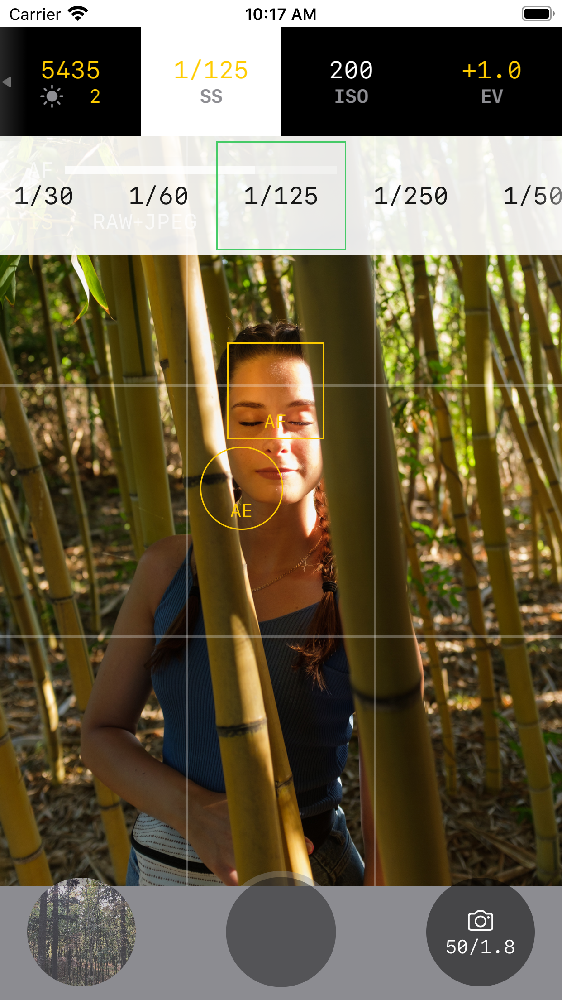

Photo camera with extended manual controls and features for photographers and photo enthusiasts. 
Capture RAW photos with auto or manual exposure.

{:style="margin-left: auto; margin-right: auto; display: block;"}

### Features:

##### RAW + JPEG/HEIC photo capturing
Select RAW format for advanced post-processing.

##### Manual ISO, shutter speed, exposure compensation
Work in Full Auto or Manual exposure modes. Get total control over your phone's camera.

##### Manual white balance controls including low-level gains control support
Tailor perfect white balance in lowlight or candid light environments.

##### Exposure and focus points selection
Spot exposure metering mode and accurate focusing.

##### Manual focusing
Lock focus or get precise focusing distance which can't be achieved with auto-focus.
 
##### Image stabilization
Take sharp photos even with slow shutter speeds (JPEG/HEIC only).

---

[Privacy Policy](privacy-policy.md)
